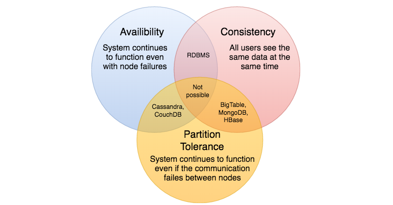

# CAP Theorem

CAP theorem states that it is impossible for a distributed software system to simultaneously provide more than two out of three of the following guarantees (CAP): Consistency, Availability, and Partition tolerance. When we design a distributed system, trading off among CAP is almost the first thing we want to consider. CAP theorem says while designing a distributed system we can pick only two of the following three options:

**Consistency**: All nodes see the same data at the same time. Consistency is achieved by updating several nodes before allowing further reads.

**Availability**: Every request gets a response on success/failure. Availability is achieved by replicating the data across different servers.

**Partition tolerance**: The system continues to work despite message loss or partial failure. A system that is partition-tolerant can sustain any amount of network failure that doesn’t result in a failure of the entire network. Data is sufficiently replicated across combinations of nodes and networks to keep the system up through intermittent outages.

<p align="center">
  
</p>

We cannot build a general data store that is continually available, sequentially consistent, and tolerant to any partition failures. We can only build a system that has any two of these three properties. Because, to be consistent, all nodes should see the same set of updates in the same order. But if the network suffers a partition, updates in one partition might not make it to the other partitions before a client reads from the out-of-date partition after having read from the up-to-date one. The only thing that can be done to cope with this possibility is to stop serving requests from the out-of-date partition, but then the service is no longer 100% available.

## Availability vs consistency
Networks aren't reliable, so you'll need to support partition tolerance. You'll need to make a software tradeoff between consistency and availability.

### CP - consistency and partition tolerance
Waiting for a response from the partitioned node might result in a timeout error. CP is a good choice if your business needs require atomic reads and writes.

### AP - availability and partition tolerance
Responses return the most recent version of the data available on a node, which might not be the latest. Writes might take some time to propagate when the partition is resolved.

AP is a good choice if the business needs allow for eventual consistency or when the system needs to continue working despite external errors.

### Source(s) and further reading
* [CAP theorem revisited](http://robertgreiner.com/2014/08/cap-theorem-revisited/)<br>
* [A plain english introduction to CAP theorem](http://ksat.me/a-plain-english-introduction-to-cap-theorem/)<br>
* [CAP FAQ](https://github.com/henryr/cap-faq)<br>

## Consistency patterns
With multiple copies of the same data, we are faced with options on how to synchronize them so clients have a consistent view of the data. Recall the definition of consistency from the CAP theorem - Every read receives the most recent write or an error.

### **Weak consistency**
After a write, reads may or may not see it. A best effort approach is taken.

This approach is seen in systems such as memcached. Weak consistency works well in real time use cases such as VoIP, video chat, and realtime multiplayer games. For example, if you are on a phone call and lose reception for a few seconds, when you regain connection you do not hear what was spoken during connection loss.

### Eventual consistency
After a write, reads will eventually see it (typically within milliseconds). Data is replicated asynchronously.

This approach is seen in systems such as DNS and email. Eventual consistency works well in highly available systems.

### Strong consistency
After a write, reads will see it. Data is replicated synchronously.

This approach is seen in file systems and RDBMSes. Strong consistency works well in systems that need transactions.

### Source(s) and further reading <br>
* [Transactions across data centers](http://snarfed.org/transactions_across_datacenters_io.html)

## Availability patterns
There are two main patterns to support high availability: **fail-over** and **replication**.

## Fail-over
### Active-passive
With active-passive fail-over, heartbeats are sent between the active and the passive server on standby. If the heartbeat is interrupted, the passive server takes over the active's IP address and resumes service.

The length of downtime is determined by whether the passive server is already running in 'hot' standby or whether it needs to start up from 'cold' standby. Only the active server handles traffic.

Active-passive failover can also be referred to as master-slave failover.

### Active-active
In active-active, both servers are managing traffic, spreading the load between them.

If the servers are public-facing, the DNS would need to know about the public IPs of both servers. If the servers are internal-facing, application logic would need to know about both servers.

Active-active failover can also be referred to as master-master failover.

## Disadvantage(s): failover
* Fail-over adds more hardware and additional complexity.
* There is a potential for loss of data if the active system fails before any newly written data can be replicated to the passive.

## Replication
### Master-slave and master-master
This topic is further discussed in the Database section:
* Master-slave replication
* Master-master replication

## Availability in numbers
Availability is often quantified by uptime (or downtime) as a percentage of time the service is available. Availability is generally measured in number of 9s--a service with 99.99% availability is described as having four 9s.

### 99.9% availability - three 9s

| Duration            | Acceptable downtime|
|---------------------|--------------------|
| Downtime per year   | 8h 45min 57s       |
| Downtime per month  | 43m 49.7s          |
| Downtime per week   | 10m 4.8s           |
| Downtime per day    | 1m 26.4s           |

### 99.99% availability - four 9s

| Duration            | Acceptable downtime|
|---------------------|--------------------|
| Downtime per year   | 52min 35.7s        |
| Downtime per month  | 4m 23s             |
| Downtime per week   | 1m 5s              |
| Downtime per day    | 8.6s               |

### Availability in parallel vs in sequence
If a service consists of multiple components prone to failure, the service's overall availability depends on whether the components are in sequence or in parallel.

#### In sequence
Overall availability decreases when two components with availability < 100% are in sequence:<br>
```
Availability (Total) = Availability (Foo) * Availability (Bar)
```
If both Foo and Bar each had 99.9% availability, their total availability in sequence would be 99.8%.

#### In parallel
Overall availability increases when two components with availability < 100% are in parallel:<br>
```
Availability (Total) = 1 - (1 - Availability (Foo)) * (1 - Availability (Bar))
```
If both Foo and Bar each had 99.9% availability, their total availability in parallel would be 99.9999%.
