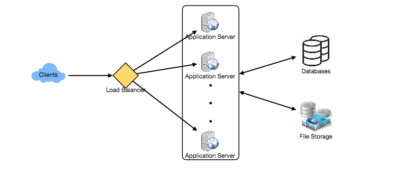

# System Design Interviews: A step by step guide
A lot of software engineers struggle with system design interviews (SDIs) primarily because of three reasons:

* The unstructured nature of SDIs, where they are asked to work on an open-ended design problem that doesn’t have a standard answer.<br>
* Their lack of experience in developing large scale systems.<br>
* They did not prepare for SDIs.<br>

Like coding interviews, candidates who haven’t put a conscious effort to prepare for SDIs, mostly perform poorly especially at top companies like Google, Facebook, Amazon, Microsoft, etc. In these companies, candidates who don’t perform above average, have a limited chance to get an offer. On the other hand, a good performance always results in a better offer (higher position and salary), since it shows the candidate’s ability to handle a complex system.

In this course, we’ll follow a step by step approach to solve multiple design problems. First, let’s go through these steps:

## Step 1: Requirements clarifications
It is always a good idea to ask questions about the exact scope of the problem we are solving. Design questions are mostly open-ended, and they don’t have ONE correct answer, that’s why clarifying ambiguities early in the interview becomes critical. Candidates who spend enough time to define the end goals of the system always have a better chance to be successful in the interview. Also, since we only have 35-40 minutes to design a (supposedly) large system, we should clarify what parts of the system we will be focusing on.

Let’s expand this with an actual example of designing a Twitter-like service. Here are some questions for designing Twitter that should be answered before moving on to the next steps:

* Will users of our service be able to post tweets and follow other people?<br>
* Should we also design to create and display the user’s timeline?<br>
* Will tweets contain photos and videos?<br>
* Are we focusing on the backend only or are we developing the front-end too?<br>
* Will users be able to search tweets?<br>
* Do we need to display hot trending topics?<br>
* Will there be any push notification for new (or important) tweets?<br>

All such question will determine how our end design will look like.

## Step 2: System interface definition
Define what APIs are expected from the system. This will not only establish the exact contract expected from the system, but will also ensure if we haven’t gotten any requirements wrong. Some examples for our Twitter-like service will be:
```
postTweet(user_id, tweet_data, tweet_location, user_location, timestamp, …) 
```
```
generateTimeline(user_id, current_time, user_location, …)  
```
```
markTweetFavorite(user_id, tweet_id, timestamp, …)  
```

## Step 3: Back-of-the-envelope estimation
It is always a good idea to estimate the scale of the system we’re going to design. This will also help later when we will be focusing on scaling, partitioning, load balancing and caching.

* What scale is expected from the system (e.g., number of new tweets, number of tweet views, number of timeline generations per sec., etc.)?<br>
* How much storage will we need? We will have different numbers if users can have photos and videos in their tweets.<br>
* What network bandwidth usage are we expecting? This will be crucial in deciding how we will manage traffic and balance load between servers.<br>

## Step 4: Defining data model
Defining the data model early will clarify how data will flow among different components of the system. Later, it will guide towards data partitioning and management. The candidate should be able to identify various entities of the system, how they will interact with each other, and different aspect of data management like storage, transportation, encryption, etc. Here are some entities for our Twitter-like service:

**User:** UserID, Name, Email, DoB, CreationData, LastLogin, etc.<br>
**Tweet:** TweetID, Content, TweetLocation, NumberOfLikes, TimeStamp, etc.<br>
**UserFollowo:** UserdID1, UserID2<br>
**FavoriteTweets:** UserID, TweetID, TimeStamp<br>

Which database system should we use? Will NoSQL like [Cassandra](https://en.wikipedia.org/wiki/Apache_Cassandra) best fit our needs, or should we use a MySQL-like solution? What kind of block storage should we use to store photos and videos?

## Step 5: High-level design
Draw a block diagram with 5-6 boxes representing the core components of our system. We should identify enough components that are needed to solve the actual problem from end-to-end.

For Twitter, at a high-level, we will need multiple application servers to serve all the read/write requests with load balancers in front of them for traffic distributions. If we’re assuming that we will have a lot more read traffic (as compared to write), we can decide to have separate servers for handling these scenarios. On the backend, we need an efficient database that can store all the tweets and can support a huge number of reads. We will also need a distributed file storage system for storing photos and videos.

<p align="center">
  <br>
</p>

## Step 6: Detailed design
Dig deeper into two or three components; interviewer’s feedback should always guide us what parts of the system need further discussion. We should be able to present different approaches, their pros and cons, and explain why we will prefer one approach on the other. Remember there is no single answer, the only important thing is to consider tradeoffs between different options while keeping system constraints in mind.

* Since we will be storing a massive amount of data, how should we partition our data to distribute it to multiple databases? Should we try to store all the data of a user on the same database? What issue could it cause?<br>
* How will we handle hot users who tweet a lot or follow lots of people?<br>
* Since users’ timeline will contain the most recent (and relevant) tweets, should we try to store our data in such a way that is optimized for scanning the latest tweets?<br>
* How much and at which layer should we introduce cache to speed things up?<br>
* What components need better load balancing?<br>

## Step 7: Identifying and resolving bottlenecks
Try to discuss as many bottlenecks as possible and different approaches to mitigate them.

* Is there any single point of failure in our system? What are we doing to mitigate it?<br>
* Do we have enough replicas of the data so that if we lose a few servers we can still serve our users?<br>
* Similarly, do we have enough copies of different services running such that a few failures will not cause total system shutdown?<br>
* How are we monitoring the performance of our service? Do we get alerts whenever critical components fail or their performance degrades?<br>

## Summary
In short, preparation and being organized during the interview are the keys to be successful in system design interviews. The above-mentioned steps should guide you to remain on track and cover all the different aspects while designing a system.

Let’s apply the above guidelines to design a few systems that are asked in SDIs.

